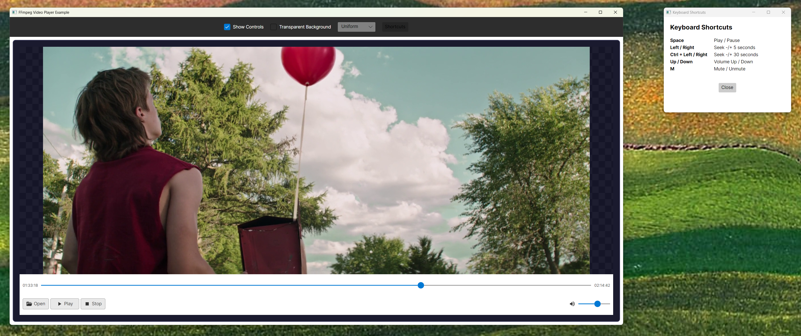

# FFmpegVideoPlayer.Avalonia

Self-contained FFmpeg video player for Avalonia UI. FFmpeg libraries bundled - no installation required.

[](https://www.nuget.org/packages/FFmpegVideoPlayer.Avalonia/)
[](LICENSE)



## Installation

```bash
dotnet add package FFmpegVideoPlayer.Avalonia
```

## Quick Start

**Program.cs:**
```csharp
using Avalonia.FFmpegVideoPlayer;

public static void Main(string[] args)
{
    FFmpegInitializer.Initialize();
    BuildAvaloniaApp().StartWithClassicDesktopLifetime(args);
}
```

**App.axaml:**
```xml
<Application.Styles>
    <FluentTheme />
    <materialIcons:MaterialIconStyles />
</Application.Styles>
```

**MainWindow.axaml:**
```xml
<ffmpeg:VideoPlayerControl />
```

## Try the Example

```bash
git clone https://github.com/jojomondag/FFmpegVideoPlayer.Avalonia.git
cd FFmpegVideoPlayer.Avalonia/examples/FFmpegVideoPlayerExample
dotnet run
```

## Properties

| Property | Type | Default | Description |
|----------|------|---------|-------------|
| `Source` | `string` | `null` | Video file path |
| `AutoPlay` | `bool` | `False` | Auto-play on load |
| `Volume` | `int` | `100` | Volume (0-100) |
| `ShowControls` | `bool` | `True` | Show control bar |
| `ShowOpenButton` | `bool` | `True` | Show file picker button |
| `ControlPanelBackground` | `IBrush` | `White` | Control bar background |

## Methods

| Method | Description |
|--------|-------------|
| `Open(path)` | Open video file |
| `Play()` | Start playback |
| `Pause()` | Pause playback |
| `Stop()` | Stop and reset |
| `Seek(float)` | Seek (0.0-1.0) |
| `ToggleMute()` | Toggle mute |

## Events

`PlaybackStarted` · `PlaybackPaused` · `PlaybackStopped` · `MediaEnded`

## Platform Support

| Platform | Status |
|----------|--------|
| Windows x64 | ✅ Bundled |
| macOS ARM64 | ✅ Bundled |
| macOS x64 / Linux | Add libs to `runtimes/<rid>/native/` |

## License

MIT
